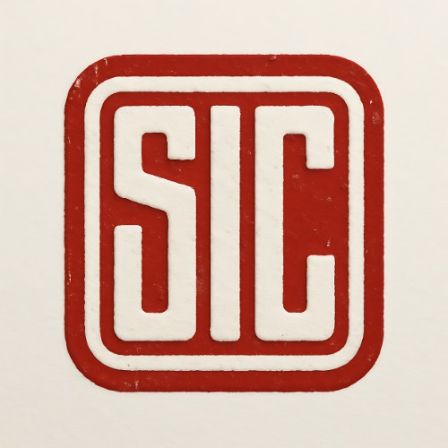

<!-- SEO: Shakthi Crafts, Slit Master, Paper Reel Inventory, Manufacturing Management, React, Supabase, Vite, TypeScript, Tailwind CSS, shadcn-ui, Factory Software, Inventory SaaS, Manufacturing SaaS, ERP, MES, Industry 4.0 -->

<p align="center">
  
</p>

<h1 align="center">Shakthi Crafts : <span style="color:#0ea5e9">Slit Master</span></h1>

<p align="center">
  <b>Revolutionize Your Paper Reel Inventory & Manufacturing Operations</b><br/>
  <i>Cloud-powered, real-time, and mobile-first platform for modern factories.</i>
</p>

<p align="center">
  <a href="https://vitejs.dev/" target="_blank"></a>
  <a href="https://react.dev/" target="_blank"></a>
  <a href="https://supabase.com/" target="_blank"></a>
  <a href="https://www.typescriptlang.org/" target="_blank"></a>
  <a href="https://tailwindcss.com/" target="_blank"></a>
  <a href="LICENSE"></a>
</p>

---

## ✨ Why Slit Master?

- **Instant Cloud Access**: Manage your inventory, planning, and calculations from anywhere, on any device.
- **Zero IT Hassle**: No servers to maintain, no local backups to worry about—Supabase handles it all.
- **Lightning Fast**: Built with Vite, React 18, and optimized for performance.
- **Enterprise-Ready Security**: Supabase Auth, RLS, and modern best practices.
- **Beautiful, Intuitive UI**: Tailwind CSS, shadcn-ui, and Lucide icons for a delightful user experience.
- **Export, Report, Succeed**: One-click CSV exports for all your business needs.

---

## 🚀 Core Features

- <b>Reel Inventory Management</b>: Add, edit, delete, search, and export reels with real-time cloud sync
- <b>Fan & Bottom Sizes</b>: Manage all size records in one place
- <b>Slit Planner</b>: Generate, optimize, and save slitting combinations for maximum efficiency
- <b>Sheet Calculator</b>: Calculate sheets, save/load presets, and export results
- <b>Authentication</b>: Secure login/logout with Supabase Auth
- <b>Data Export</b>: Download CSV reports for all modules
- <b>Responsive UI</b>: Beautiful, fast, and mobile-ready (Tailwind CSS + shadcn-ui)
- <b>Cloud Storage</b>: All data is securely stored in Supabase (no localStorage)
- <b>Splash Screen & Loading Spinners</b>: Modern, polished user experience
- <b>Role-based Access</b>: (Optional, easy to extend)
- <b>Dark Mode</b>: (Easy to enable for your brand)

---

## 🛠️ Tech Stack

<p align="center">
  
  
  
  
  
  
  
  
</p>

<p align="center"><b>Modern, scalable, and lightning-fast.<br/>Every tool chosen for developer joy and business reliability.</b></p>

<table align="center">
  <tr>
    <td> <b>React 18</b></td>
    <td>Component-driven UI, concurrent rendering, hooks</td>
  </tr>
  <tr>
    <td> <b>Vite</b></td>
    <td>Ultra-fast dev server, instant HMR, optimized builds</td>
  </tr>
  <tr>
    <td> <b>TypeScript</b></td>
    <td>Type safety, autocompletion, robust codebase</td>
  </tr>
  <tr>
    <td> <b>Tailwind CSS</b></td>
    <td>Utility-first, responsive, beautiful design</td>
  </tr>
  <tr>
    <td> <b>shadcn-ui</b></td>
    <td>Modern, accessible, customizable UI components</td>
  </tr>
  <tr>
    <td> <b>Supabase</b></td>
    <td>Cloud Postgres, Auth, RLS, real-time sync</td>
  </tr>
  <tr>
    <td> <b>Lucide Icons</b></td>
    <td>Pixel-perfect, open-source icon set</td>
  </tr>
  <tr>
    <td> <b>ESLint</b></td>
    <td>Consistent, error-free code</td>
  </tr>
  <tr>
    <td> <b>Prettier</b></td>
    <td>Beautiful, auto-formatted code</td>
  </tr>
</table>

---

## 📦 Getting Started

### Prerequisites
- Node.js (v18+ recommended)
- npm or yarn
- Supabase project (see below)

### 1. Clone & Install
```sh
git clone https://github.com/karthi-AI-hub/Slit_Master.git
cd shakthi-crafts-v1
npm install
```

### 2. Configure Supabase
- Create a [Supabase](https://supabase.com/) project
- Set up tables: `reels`, `fan_sizes`, `bottom_sizes`, `slit_results`, `sheet_presets`
- Enable Row Level Security (RLS) and configure policies
- Add your Supabase URL and Anon Key to a `.env` file:
  ```env
  VITE_SUPABASE_URL=your-supabase-url
  VITE_SUPABASE_ANON_KEY=your-anon-key
  ```

### 3. Run Locally
```sh
npm run dev
```
Visit [http://localhost:8080](http://localhost:8080)

### 4. Build for Production
```sh
npm run build
```

### 5. Lint & Format
```sh
npm run lint
```

---

## 📸 Screenshots

<p align="center">
  
</p>

---

## 💡 Use Cases

- Paper cup, packaging, and label manufacturers
- Factory floor inventory management
- Production planning and optimization
- Small/medium manufacturing ERP modules
- Any business needing secure, cloud-based inventory & planning

---

## 🤝 License

This project is licensed under the [MIT License](LICENSE).

---